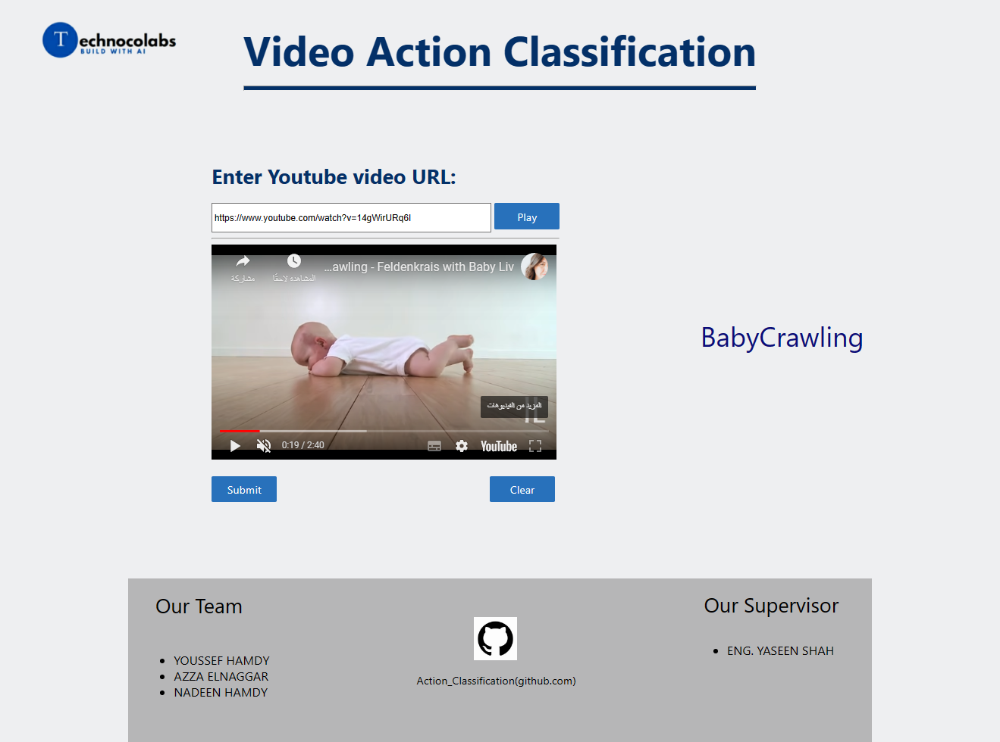

# Video Action Classification

 **about project:**
 
 video classification using the UCF101 and kinetics-700 action recognition dataset.
 
 **dataset_links**
 
  https://www.deepmind.com/open-source/kinetics
  
  https://www.tensorflow.org/datasets/catalog/ucf101
  
  
  ###### Selected classes from ucf101 are
  
  ['ApplyEyeMakeup','ApplyLipstick','Archery','BabyCrawling','BalanceBeam','BandMarching',
            'BaseballPitch','BasketballDunk','Basketball','BenchPress','Biking',
            'Billiards','BlowDryHair','BlowingCandles','BodyWeightSquats','Bowling',
            'BoxingPunchingBag','BoxingSpeedBag','BreastStroke','BrushingTeeth']

 - We used the 2 datasets to make a prediction but used ucf101 for production.
  
 * We make many traials to get the final results.
  
 + Deploy tensorflow model using flask.
  
  **OUTPUT**
 
  
  
  
  
 
  
 
